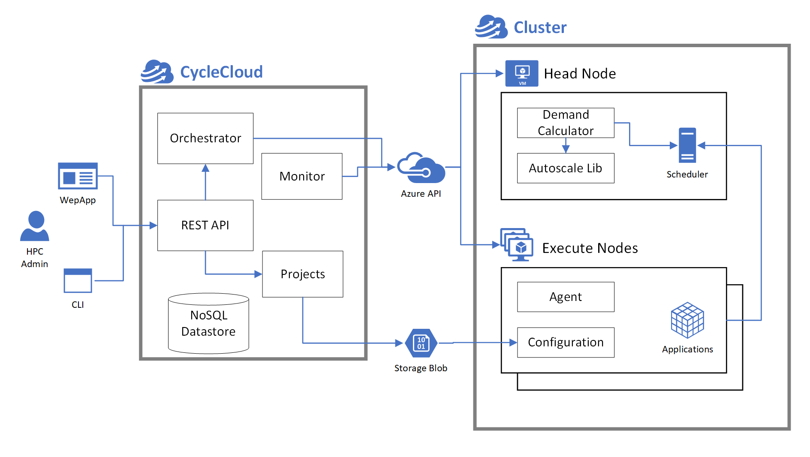

# Step00 – Concept

## 학습 목표
이 Step에서는 Azure에서 HPC 환경을 구축하기 전에 반드시 이해해야 하는 핵심 개념을 정리합니다.

- HPC(High Performance Computing)의 구조와 특징 이해
- Scheduler(이번 워크샵: Slurm)의 역할 이해
- Azure CycleCloud가 무엇이며 어떤 문제를 해결하는지 이해
- CycleCloud “애플리케이션 서버(Application Server)”와 “클러스터(Cluster)”의 역할 분리 이해
- Head/Login/Scheduler/Execute(Compute) 노드 역할 구분 이해
- Autoscale이 어디에서 어떤 흐름으로 트리거되는지 이해

> 이 Step은 실습보다는 **이후 Step들을 이해하기 위한 개념 오리엔테이션**입니다.

---

## 1. HPC란 무엇인가?
가장 기본적으로 HPC 시스템은 다음 조합으로 이루어진 “계산 리소스 풀”입니다.

- 다수의 계산 노드(Compute/Execute Nodes)
- 저지연 네트워크(클러스터 내부 통신)
- 고성능 파일 시스템(공유 스토리지)
- 작업을 예약/배치하는 **HPC Scheduler**(예: Slurm)

HPC 스케줄러는 여러 사용자의 작업(Job)을 큐(Queue)에 적재하고, 사용 가능한 노드에 작업을 배치하여 클러스터 자원을 관리합니다.

대표적인 HPC 워크로드 예:
- AI Training / 대규모 추론
- CFD / 과학·공학 시뮬레이션
- Rendering / Batch 처리
- Monte Carlo 분석
- Genomics

---

## 2. HPC에서 Scheduler가 필요한 이유
여러 사용자가 동시에 Job을 제출하면, 다음을 누가 결정해야 합니다.

- 어떤 Job을 먼저 실행할지 (우선순위/정책)
- 어떤 노드에 배치할지 (자원 매칭)
- 공정한 자원 분배(Quota/공유 정책)
- 노드 상태에 따른 배치 제한(장애/Drain 등)

이번 워크샵에서는 **Slurm**을 사용합니다.

### Slurm 핵심 용어
| 용어 | 의미 |
|---|---|
| Job | 실행할 작업 단위 |
| Node | 계산 노드(보통 VM) |
| Partition | 노드 그룹 |
| Queue | 대기열 |
| Controller | 스케줄러 |

대표 명령어:
```bash
sinfo
squeue
srun
sbatch
```

---

## 3. Azure CycleCloud는 무엇인가?
**Azure CycleCloud는 Azure에서 HPC 시스템을 구성/배포/운영하도록 돕는 플랫폼**입니다.

중요 포인트:
- CycleCloud는 Compute Node가 아닙니다.
- CycleCloud는 Scheduler 자체가 아닙니다.
- CycleCloud는 클러스터 관리자 + 오케스트레이션 역할입니다.

---

## 4. CycleCloud 아키텍처(핵심 구성요소)

### 4.1 애플리케이션 서버(Application Server)가 제공하는 것
- REST API: 클러스터 관리 인터페이스
- GUI(Web UI): 관리 화면
- CLI: 자동화 도구
- 내부 NoSQL 데이터 저장소
- Orchestration: Azure VM 생성/삭제
- Monitoring: 노드 상태 추적

### 4.2 통합(Integration)이 제공하는 것
- 노드 준비/구성 시스템
- 스케줄러 기반 Autoscale

---

## 5. CycleCloud VM vs Cluster VM – 역할 분리

### 5.1 CycleCloud VM (Application Server)
- 클러스터 관리 서버
- 템플릿/프로젝트/노드 구성 관리
- Azure API 호출

### 5.2 Cluster VM (Head / Execute Nodes)
- 실제 HPC 클러스터 구성 VM
- Head Node + Execute Nodes

---

## 6. 아키텍처 다이어그램



### 구성요소 설명
- Orchestrator: 클러스터 수명주기 관리
- Monitor: 노드 상태 감시
- REST API: 관리 인터페이스
- NoSQL Datastore: 상태 저장
- Projects: 클러스터 템플릿

클러스터 측:
- Head Node: 스케줄러 포함
- Demand Calculator / Autoscale Lib: 노드 수요 계산
- Execute Nodes: 실제 계산 수행
- Agent / Configuration: 노드 구성

---

## 7. 노드 역할 정리

### Login Node
- SSH 접속 및 Job 제출

### Scheduler Node
- Job Queue 관리

### Execute/Compute Nodes
- 실제 계산 수행
- Autoscale 대상

---

## 8. Autoscale 흐름
```text
1) Job 제출
2) Scheduler Queue 확인
3) Autoscale 수요 계산
4) CycleCloud가 Azure API 호출하여 VM 생성
5) Node 구성 후 Job 실행
6) Idle 시 Node 축소
```

---

# Step00 완료 체크리스트

다음 항목을 이해했는지 확인합니다.

* [ ] HPC 기본 구성 요소(노드/네트워크/스토리지/스케줄러)
* [ ] Slurm 핵심 용어(Job, Node, Partition, Queue, Controller)
* [ ] CycleCloud VM과 Cluster VM의 역할 분리
* [ ] Autoscale 트리거 및 동작 흐름

---

# 다음 Step
Step01에서는 Azure Portal에서 아래를 준비합니다.

- Resource Group
- VNet / Subnet
- Shared Storage

이제 실제 HPC 환경 구축을 시작합니다.